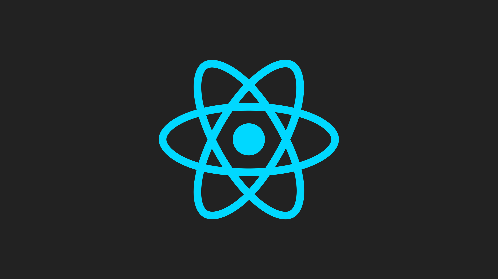

## Why it is archived?

This repo was originally my personal React "starting kit" that I've used internally within companies for a couple of years since 2017 and then moved here to Github, [Create React App](https://create-react-app.dev/) was in its very early stages and creating a custom boilerplate repo for React was quite a common task.

Today isn't the case anymore since CRA has grown way better and alternative tools like [Vite](https://vitejs.dev/) are even better suited for small and performant webapps.

So this repo is now quite a relic of that time, still useful if you want to see how to configure React and Webpack from scratch... but nothing more!

---

# react-minimal

> A minimal starter kit for React with Webpack, Typescript, SASS &amp; CSS Modules.



As the name says, this is _another_ React starter kit created to give the minimum-viable-configuration to get started a new React based project with less dependencies and boilerplate as possible.

Developed mainly for me 😎 but open to everyone who may find this useful.

- React & React DOM
- Typescript
- Webpack
  - HTML plugin
- SASS & normalize.css
- Styles loaded as CSS Modules
- gh-pages (publish)

## Get started

A few steps to quick-start a new project:

Clone the repo on a new folder

```
$ git clone https://github.com/moebiusmania/react-minimal my-project
```

Change the name in the `package.json`, this will also affect the HTML title and the Webpack's notifications:

```json
...
  "name": "my-project"
...
```

then

```
$ npm ci
```

to install dependencies, and

```
$ npm start
```

to start webserver on `localhost:3000`

## Build & publish

To create deployable static files in the `./dist` folder:

```
$ npm run build
```

to deploy the `./dist` folder as a Github page:

```
$ npm run deploy
```

## Styles

This starter kit supports both regular CSS and SASS, with a little difference in how they are managed:

- `.css` files are handled as regular CSS.
- `.scss` files are loaded as CSS modules, this is a best fit for components.

## Changelog

Check the [releases page](https://github.com/moebiusmania/react-minimal/releases/) to get updated on what changed in the latest version.

## License

Released under the [MIT license](LICENSE).
